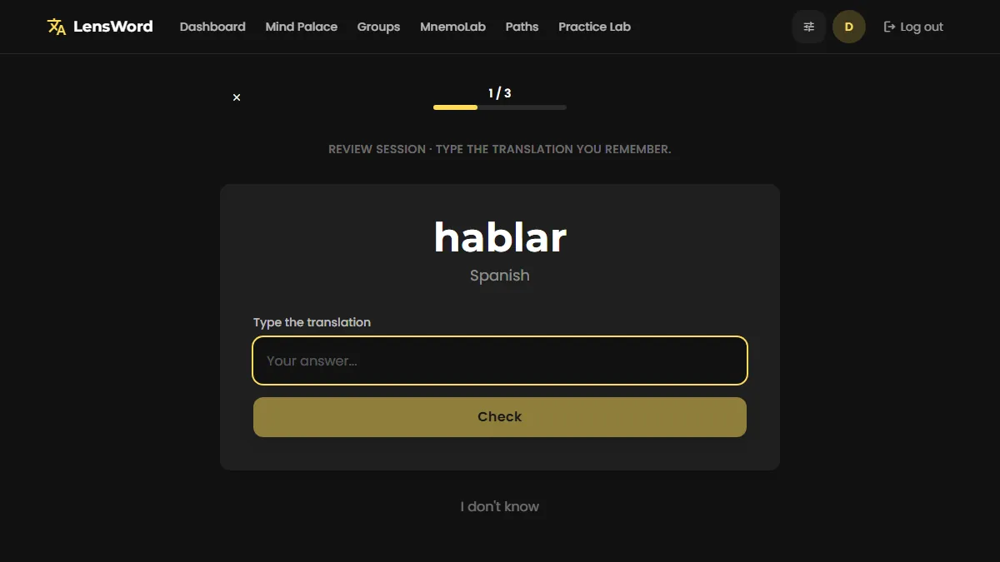
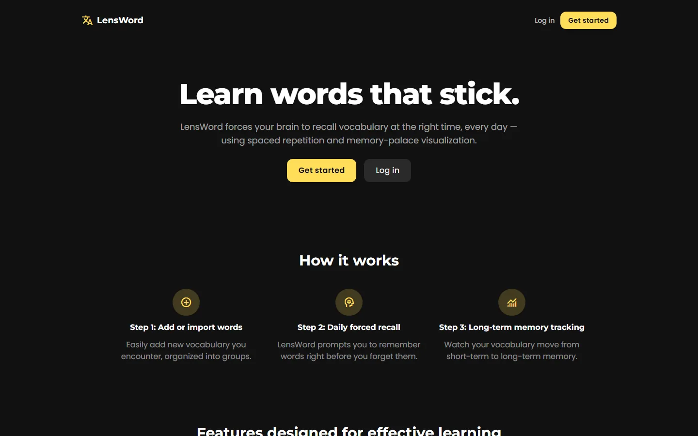
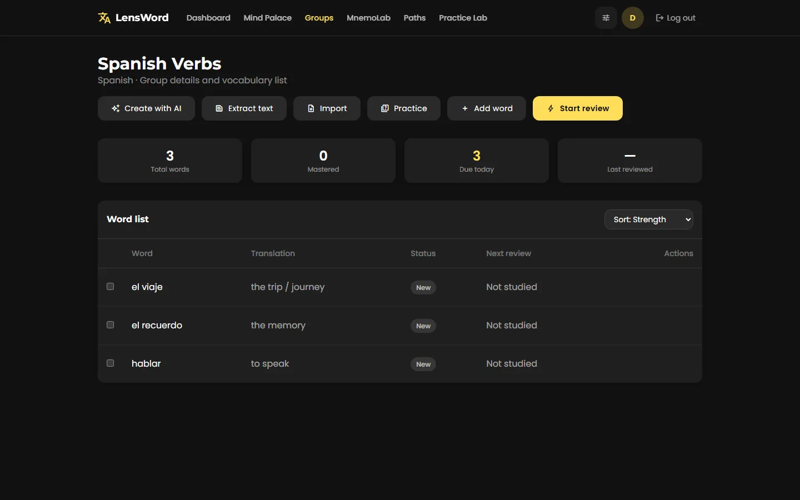
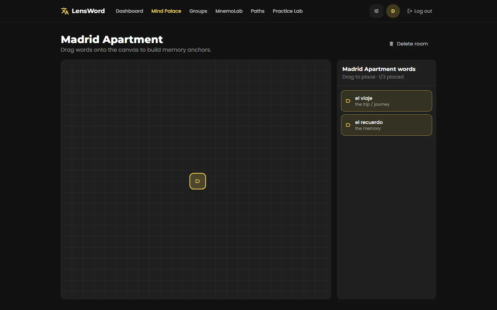
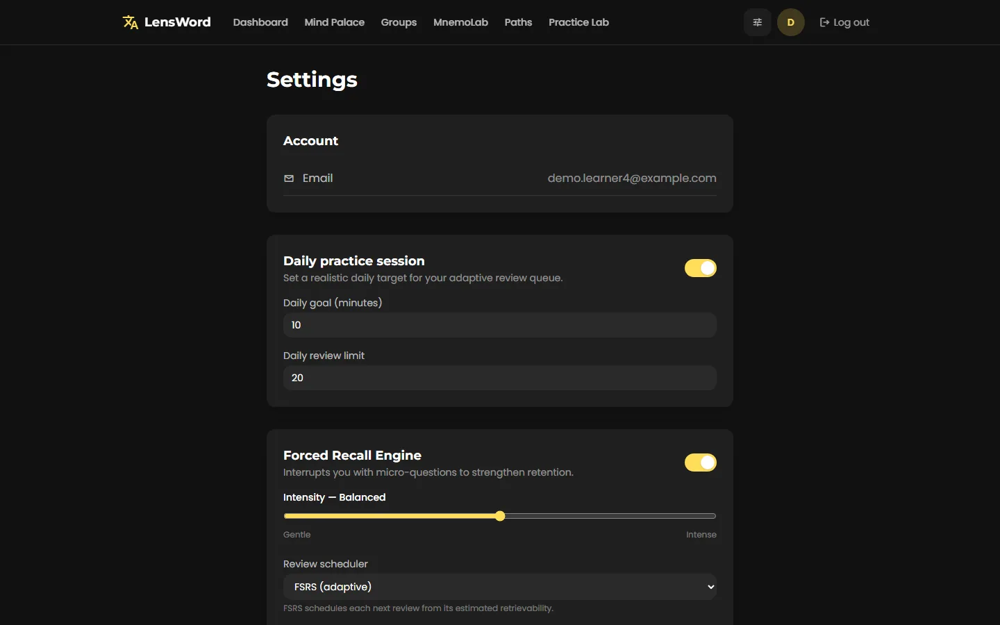
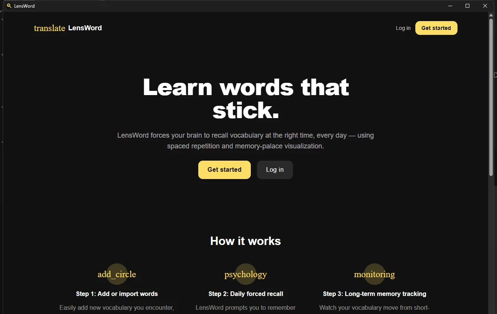
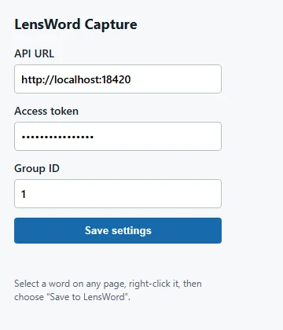
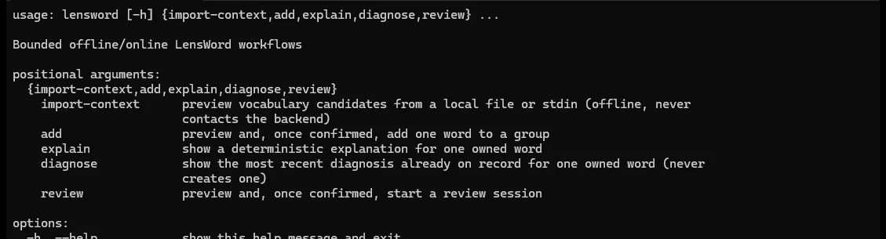

<p align="center">
  <picture>
    <source media="(prefers-color-scheme: dark)" srcset="brand/logo/webp/lensword-lockup-white.webp">
    
  </picture>
</p>

<p align="center"><strong>LensWord is an open-source vocabulary trainer that forces spaced-repetition recall and lets you anchor words spatially in a memory palace.</strong></p>

<p align="center">
  <a href="https://github.com/conectlens/lensword/actions/workflows/ci.yml"></a>
  <a href="LICENSE"></a>
  <a href="CHANGELOG.md"></a>
  <br />
  <a target="_blank" href="https://github.com/sponsors/conectlens"></a>
  <a target="_blank" href="https://patreon.com/ofcskn"></a>
  <a href="mailto:lensword@conectlens.com"></a>
</p>

<p align="center">
  <a href="https://lensword-frontend.pages.dev"><strong>Try the web app</strong></a> ·
  <a href="https://conectlens.github.io/lensword/">Documentation</a> ·
  <a href="https://github.com/conectlens/lensword/blob/development/docs/internal/render-deployment.md">API</a> ·
  <a href="https://github.com/conectlens/lensword/blob/development/docs/reference/mcp-remote-transport.md">MCP server</a>
</p>

No release has shipped yet (see [Current status and known limitations](#current-status-and-known-limitations)) — this is an active, evidence-documented open-source project, not a finished product. The links above reflect real, current deployment status, not aspirational ones: the web app and docs site are live; the hosted API and MCP server are not deployed yet (see the linked docs for what that will look like once they are).

## What can I do with LensWord?

- **Build personal vocabulary groups** — decks like "Spanish Verbs" or "Business English," each word with translations, an example sentence, your own mnemonic, and a category.
- **Review with spaced repetition and forced recall** — an SM-2-based scheduler prompts you right before you'd forget a word, and you type the answer instead of just recognizing it.
- **Organize words spatially in the Mind Palace** — drag words onto a 2D room canvas as spatial memory anchors (the method of loci).
- **Practice conversation, scenarios, writing, and pronunciation feedback** — the Practice Lab covers guided conversations, scenario prompts, writing exercises, and pronunciation/transcript feedback beyond flashcard review.
- **Use local, Ollama-powered mnemonic suggestions** — MnemoLab can ask a locally hosted model for a mnemonic; off by default, nothing leaves your machine when it's on.
- **Capture words while browsing** — the browser extension saves selected text on a page straight into a LensWord group.
- **Use LensWord from a desktop shell** — a Tauri app that talks to a LensWord server over the network.
- **Connect an MCP-capable AI client, or use the bounded local CLI** — give Claude, Codex, Cursor, or another MCP client scoped access to your vocabulary, or preview/import developer context locally without ever contacting the server.
- **Self-host LensWord for yourself or a team** — one Docker Compose stack, with documented limitations (see the surface chooser below).

## Choose your surface

| Surface | Best for | Install / access | Requires | Status |
|---|---|---|---|---|
| **Web app** | Everyday review in a browser | `docker compose up --build` (below) | Nothing else — the stack bundles its own Postgres | Public, CI-tested |
| **Self-hosting for others** | Running LensWord as a shared service | [docs/install/self-hosting.md](docs/install/self-hosting.md) | Managed Postgres, TLS, real secrets | Public, documented; notifications are log-only (see limitations) |
| **Desktop app** (macOS / Windows / Linux) | A native shell around the same app | Build from source today — see [docs/install/desktop-app.md](docs/install/desktop-app.md) | A running LensWord server (remote-only, [ADR 0002](docs/reference/adr/0002-desktop-backend-mode.md)) | **Unreleased** — no installer has been published; CI currently builds macOS and Linux only |
| **Browser extension** | Capturing words while reading | Load unpacked — see [apps/browser/README.md](apps/browser/README.md) | A running LensWord server | Functional, developer-mode only — not on the Chrome Web Store, no CI coverage |
| **MCP server** | Claude, Codex, Cursor, or another MCP client | Run from source — see [apps/mcp/README.md](apps/mcp/README.md) and [docs/reference/mcp-remote-transport.md](docs/reference/mcp-remote-transport.md) | A LensWord account + API URL; remote transport is off by default | Functional, not on PyPI, no CI coverage |
| **Local CLI** | Bounded, offline context preview/import | Run from source — see [apps/mcp/README.md](apps/mcp/README.md) | Local Python install only for `import-context` (offline, never contacts the server) | Functional, not on PyPI |

Per-surface deep-dive guides (verified desktop/browser/MCP walkthroughs) are being written in the documentation epic ([#268](https://github.com/conectlens/lensword/issues/268)) — until they land, the links above point at the most accurate source that exists today. See [docs/internal/repo-audit.md](docs/internal/repo-audit.md) for the full evidence behind this table.

## Quick start

The fastest path that's actually been run end-to-end: Docker Compose, which bundles its own Postgres and serves both the API and the web app.

**Prerequisites:** Docker and Docker Compose.

```bash
cp .env.example .env
# Edit .env and set SECRET_KEY and POSTGRES_PASSWORD to real values —
# see the comments in .env.example for how to generate a SECRET_KEY.

docker compose up --build
```

- Frontend: **http://localhost:18421**
- Backend API: **http://localhost:18420** (interactive docs at `/docs`)

Register an account from the frontend, or set `FIRST_ADMIN_EMAIL` /
`FIRST_ADMIN_PASSWORD` in `.env` before first boot to create an admin account
automatically.

**Verified:** `docker compose up --build` builds both containers, boots them
healthy, and serves traffic on the ports above — confirmed by running it and
walking through registration, onboarding, adding words, and a review session
(see the screenshots below).

For everything past this — [local development without Docker](docs/reference/local-development.md), [hosted
deployment for other people](docs/install/self-hosting.md), [desktop builds](docs/install/desktop-app.md), [browser extension loading](apps/browser/README.md), [MCP configuration](apps/mcp/README.md), and [local AI](docs/install/local-ai-ollama.md) — see [Documentation](#documentation) below.

## See it in action

Real captures from each surface — a `docker compose up --build` run for
Web, a local build for Desktop, the popup UI for the extension, and a real
terminal session for the CLI. Nothing here is a mockup; regenerate all of
it yourself with `node scripts/capture-demo-media.mjs && python
scripts/assemble-demo-animation.py` (Web) — see each surface's guide,
linked below, for how its own screenshots were produced.

**Web** — forced-recall review session, animated from 4 real frames (question → typed answer → "Correct!" → next word):



| | |
|---|---|
|  |  |
| Landing page | A group with real words, translations, and mnemonics |
|  |  |
| Mind Palace: words placed as spatial anchors | Review scheduler and Forced Recall settings |

**Desktop, Browser Extension, and MCP/CLI:**

| | | |
|---|---|---|
|  |  |  |
| Desktop shell, launched from a local Windows build ([verified how](docs/install/desktop-app.md)) | Browser extension popup UI (shown standalone — `chrome://` pages can't be captured by this repo's automation) | Local CLI, `lensword --help`, real terminal output |

## Current status and known limitations

No tagged release exists yet for any surface — everything below is evaluated
against the current `development` branch, not a versioned artifact. See
[docs/internal/repo-audit.md](docs/internal/repo-audit.md) for the full,
evidence-based breakdown per surface.

- **Desktop:** no installer has ever been published, and native toast
  notifications are unit-tested but have never been observed on a real,
  packaged build of macOS, Windows, or Linux. Unsigned builds will show a
  Gatekeeper (macOS) or SmartScreen (Windows) warning. Treat desktop
  notifications as implemented and unverified, not proven.
- **Push and email notifications** have no credentialed provider behind
  them — the only adapter writes the message to the application log, so
  nothing is actually delivered through those channels. Desktop
  notifications are the only channel with a real, if unverified, delivery
  path.
- **Browser extension** is developer-mode only (manual "Load unpacked"),
  not published to the Chrome Web Store, and has no CI coverage. First
  release scope is narrow — hardcoded to Spanish, no translations.
- **MCP server and local CLI** are not published to PyPI; install is
  source-only. No CI job builds or tests either.
- **AI mnemonic suggestions** (MnemoLab, via Ollama) are real and verified
  against a live model, but off by default and require a local Ollama
  install — see [Documentation](#documentation).
- No refresh-token rotation — a single 7-day access token. Fine for
  personal use, not for a production launch.
- Backend: 96/96 tests passing, boot-tested with a real `uvicorn` process.
  Frontend: lints clean, type-checks and builds clean, unit tests passing.
  Full detail in [docs/reference/verification.md](docs/reference/verification.md), which also
  lists every known gap. See
  [docs/internal/evidence-gaps.md](docs/internal/evidence-gaps.md) for what
  has explicitly **not** been verified (e.g. no branch-protection visibility
  from the repo, no live third-party MCP interop test).

## Documentation

`docs/` is a [VitePress](https://vitepress.dev) site, organized around
[Diátaxis](https://diataxis.fr/): a **Setup** tutorial, task-oriented
**Install** how-to guides, **Learn** explanation, and lookup **Reference**
material. Run it locally with `cd docs && npm install && npm run docs:dev`.
The same Markdown files are linked directly below, so they're just as
readable straight from GitHub.

- **Setup:** [docs/setup/index.md](docs/setup/index.md) — the same verified quick start as above, plus where to go next.
- **Install:** [web app](docs/install/web-app.md) · [desktop](docs/install/desktop-app.md) · [browser extension](docs/install/browser-extension.md) ([apps/browser/README.md](apps/browser/README.md)) · [MCP server & local CLI](docs/install/mcp-local-cli.md) ([apps/mcp/README.md](apps/mcp/README.md)) · [self-hosting](docs/install/self-hosting.md) · [local AI / Ollama](docs/install/local-ai-ollama.md) · [troubleshooting](docs/install/troubleshooting.md)
- **Learn:** [architecture & design decisions](docs/learn/architecture.md) · [choose your surface](docs/learn/choose-a-surface.md) · [brand assets](docs/learn/brand.md)
- **Reference:** [verification & known gaps](docs/reference/verification.md) · [AI model verification log](docs/reference/ai-model-verification.md) · [changelog](docs/reference/changelog/index.md) · [releasing & compatibility](docs/reference/releasing.md) · [MCP remote transport](docs/reference/mcp-remote-transport.md) · [local development](docs/reference/local-development.md) · [ADRs](docs/reference/adr/)
- **Evidence base:** [docs/internal/repo-audit.md](docs/internal/repo-audit.md), [product-registry.json](docs/internal/product-registry.json), [docs-migration-map.md](docs/internal/docs-migration-map.md), [evidence-gaps.md](docs/internal/evidence-gaps.md) — not part of the published site (internal, excluded from the VitePress build), but this README and the whole documentation rewrite are built on them.

## Changelog, releases & trust

LensWord isn't one product with one version — Web, Desktop, Browser
Extension, and MCP Server/Local CLI each have their own changelog,
release identity, and verification evidence, generated from structured
fragments under [`.changes/`](.changes/) rather than hand-copied between
places:

- [docs/reference/changelog/index.md](docs/reference/changelog/index.md) — the changelog overview, with a page per product.
- [docs/reference/changelog/main-branch-activity.md](docs/reference/changelog/main-branch-activity.md) — what's merged into `development`, explicitly **not** the same as released.
- [docs/reference/releases/index.md](docs/reference/releases/index.md) — published, immutable release records. None exist yet for any product — confirmed via `git tag -l` and `gh release list`, both empty.
- [docs/reference/trust/verification-levels.md](docs/reference/trust/verification-levels.md) — what "Automated Tests Passed," "Manually Verified," etc. actually mean, and don't mean.
- [docs/reference/trust/release-process.md](docs/reference/trust/release-process.md) — the versioning/tagging decision (namespaced per product: `desktop-v`, `web-v`, `browser-v`, `mcp-v`) and how a merged change becomes a released one.
- [docs/reference/trust/compatibility.md](docs/reference/trust/compatibility.md) — cross-product compatibility. Every cell reads "Not declared" today, honestly, since no release has ever existed to declare one.
- [CHANGELOG.md](CHANGELOG.md) / [docs/reference/changelog/legacy.md](docs/reference/changelog/legacy.md) — the original, repository-wide changelog, preserved in full as a historical record rather than retroactively (and speculatively) reclassified into per-product entries.

CI enforcement of changelog fragments (failing a PR that changes observable behavior without one) is tracked separately in [#282](https://github.com/conectlens/lensword/issues/282) and doesn't exist yet — `scripts/changelog/schema.py` validates fragments today as a script contributors can run by hand.

## Sponsorship & support

LensWord is built and maintained in the open. If it's useful to you or your
team, sponsoring keeps development moving — maintenance, the documentation
work in this repository, cross-platform desktop verification (real
hardware and CI time for macOS/Windows/Linux), eventual release
signing/notarization, hosting, and accessibility work all cost real time
and, for some of them, real money. Sponsoring doesn't buy roadmap
priority, security guarantees, or private access — there's no such policy
today, and this won't imply one that doesn't exist.

- [GitHub Sponsors](https://github.com/sponsors/conectlens) — individual or organizational
- [Patreon](https://patreon.com/ofcskn) — individual
- Sponsorship, partnerships, product questions, or other business contact: **[lensword@conectlens.com](mailto:lensword@conectlens.com)**

Use [GitHub Issues](https://github.com/conectlens/lensword/issues) for bugs
and feature requests — that's where the project actually tracks work. Use
email for anything that shouldn't be public (sponsorship terms,
partnership discussions) or that isn't a code issue. Security
vulnerabilities go through [SECURITY.md](SECURITY.md), not a public issue
or this email address. No response-time guarantee exists for any channel.

## Contributing

Contributions are welcome. See [CONTRIBUTING.md](CONTRIBUTING.md) for
development setup, running tests/lint, and the pull request process. This
project follows a [Code of Conduct](CODE_OF_CONDUCT.md).

## Security

To report a security vulnerability, please see [SECURITY.md](SECURITY.md)
rather than opening a public issue.

## License

[MIT](LICENSE)
