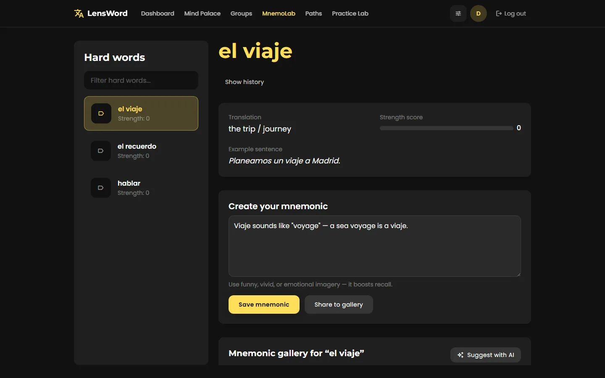
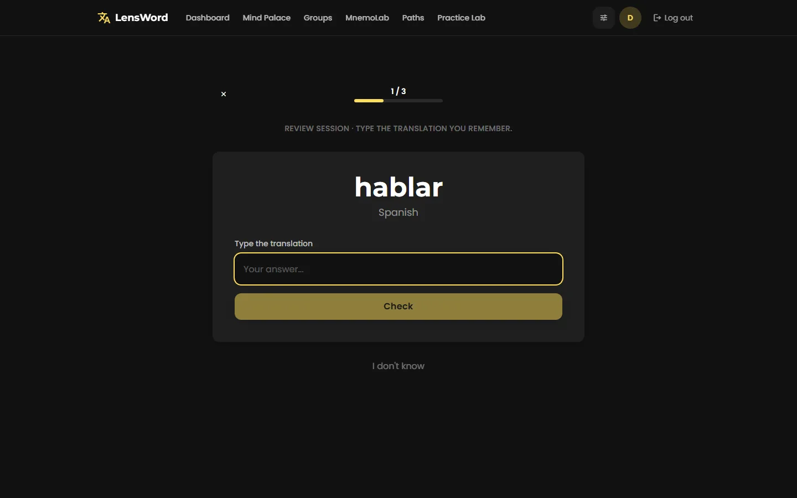
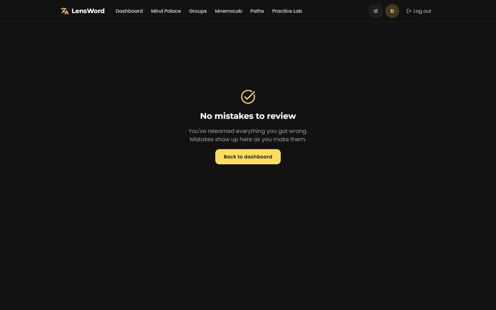
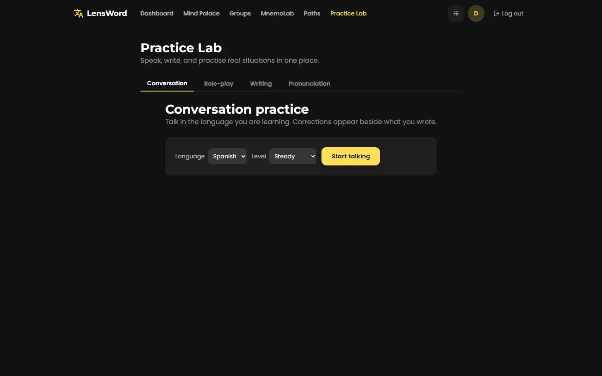

# Web Application

The web app (`apps/frontend`) is LensWord's primary, publicly usable surface
— it's the most complete and CI-tested surface, and the one every screenshot
in this documentation was taken from.

## Access modes

| Mode | What it is | Database | Guide |
|---|---|---|---|
| Docker Compose (recommended) | Everything on one host: frontend, backend, Postgres | Postgres (bundled) | This page, below |
| Local development | Backend and frontend run directly, for changing the code itself | SQLite by default | [Local development](/reference/local-development) |
| Self-hosted for others | Running LensWord as a shared service | Managed Postgres | [Self-Hosting & Deployment](/install/self-hosting) |

**SQLite vs. Postgres:** SQLite (the local-development default) is fine for
one person developing on the code, with no setup — the file lives at
`apps/backend/data/lensword.db`. Postgres is required for the Docker Compose
stack and for self-hosting: it's what CI runs the full test suite against
(`backend-postgres` job), and it's the only path that's been exercised for
concurrent access and migrations under `alembic upgrade head` in a
multi-request environment. Don't run SQLite for anything other than solo
local development.

## Quick start

```bash
cp .env.example .env
# set SECRET_KEY and POSTGRES_PASSWORD — see .env.example's comments
docker compose up --build
```

- Frontend: `http://localhost:18421`
- Backend API: `http://localhost:18420` (`/docs` for interactive API docs)

This is the same command covered in [Getting Started](/setup/),
verified end to end by registering, completing onboarding, creating a group,
adding words, running a review session, and placing a word in a Mind Palace
room.

### First-success checklist

You've actually succeeded when you can check off all of these — not just
"the containers are running":

- [ ] `http://localhost:18421` loads the landing page.
- [ ] You can register an account (or log in, if `FIRST_ADMIN_EMAIL`/
      `FIRST_ADMIN_PASSWORD` created one for you) and reach the dashboard.
- [ ] You've created at least one vocabulary group.
- [ ] You've added at least one word with a translation.
- [ ] You've completed one forced-recall review question and seen the
      result (correct or incorrect) recorded.

That last step is the real outcome LensWord exists for — a server that
merely boots doesn't demonstrate spaced repetition works.

## Core learner workflows

Each of these was walked through end to end against a real running instance
(`docker compose up --build`, registered as a fresh account) to produce the
screenshot and confirm the described behavior — not written from the UI code
alone.

### Create an account and sign in

Registration asks for a username, email, and password, then walks you
through a 4-step onboarding flow: target language(s), your preferred Forced
Recall intensity (Gentle/Balanced/Intense), and creating your first group.
Login afterward only needs email and password.


### Create a vocabulary group

Groups (**Groups** in the top nav) are named decks tied to one target
language — "Spanish Verbs," "Business English." Creating one asks for a
name and a target language; nothing else is required before you can start
adding words.

The **Edit** button on a group card changes both its name and its target
language after the fact, so a group created against the wrong language
doesn't have to be deleted and rebuilt. Words already in the group keep the
language they were added with — a word card records which language that
word is in, and that stays true however the group is relabelled. The editor
states this before you save when the group already holds words.

### Add or import words

From a group page, **Add word** opens a form for the term, its
translation(s), an example sentence, an optional personal mnemonic, and a
category. Words can also be added via **Extract text** (pull candidate
vocabulary out of pasted text) or **Import**, and **Create with AI** offers
AI-assisted word creation when a provider is configured (see
[Local AI / Ollama](/install/local-ai-ollama)).


### Enrich and verify a word card

Open a word from **MnemoLab** (not just the group's word list) to see its
full card: translation, example sentence, a strength score, and a mnemonic
editor. **Suggest with AI** fills the mnemonic field automatically when a
local AI provider is configured; without one, the field is just a plain text
box you write into yourself. A **mnemonic gallery** below the editor is
where community-style mnemonics for a word are meant to surface (see
[Architecture § MnemoLab is per-word, not cross-user-global](/learn/architecture)
for the current scope of that feature).



### Run a review session

**Start review session** on the dashboard, or **Start review** on a group
page, begins a forced-recall session: LensWord shows the word and you type
the translation, rather than picking from options — the whole point of
*forced* recall over passive recognition.


Generated from 4 real, automated frames (question → typed answer →
"Correct!" → next word) — see
[scripts/capture-demo-media.mjs](https://github.com/conectlens/lensword/blob/development/scripts/capture-demo-media.mjs)
and
[scripts/assemble-demo-animation.py](https://github.com/conectlens/lensword/blob/development/scripts/assemble-demo-animation.py)
to regenerate it yourself; both scripts are documented inline. Static
fallback:


Five presentation modes share this same session mechanic (`mode` query
param on `/review`), not five separate implementations — see
[Architecture § One `ReviewSessionPage`, not five](/learn/architecture):

| Mode | URL | Behavior |
|---|---|---|
| Standard | `/review?mode=standard` | Type the translation, no time pressure |
| Focus | `/review?mode=focus` | Same, with a visible countdown timer |
| Walking | `/review?mode=walking` | Multiple-choice, tuned for one-handed use |
| Night wind-down | `/review?mode=night` | Multiple-choice, a short session (3 words) before sleep |
| Study break | `/review?mode=break` | Multiple-choice, a very short session (2 words) between study blocks |

**Review my mistakes** (`/review?mode=mistakes`) re-tests words you got
wrong. If you haven't missed anything yet, it says so plainly rather than
showing an empty, ambiguous screen:



### Use Mind Palace rooms and spatial anchors

**Mind Palace** in the top nav lists your memory rooms. Creating one asks
for a name, which group's words it draws from, and an icon. Inside a room,
drag a word from the sidebar list onto the canvas to place it as a spatial
anchor (the method-of-loci technique) — a placed word shows as a small
marker at the position you dropped it.


### Use Practice Lab workflows

**Practice Lab** (`/lab`) covers four practice modes beyond flashcard
review: **Conversation**, **Role-play**, **Writing**, and **Pronunciation**.
Conversation practice lets you pick a difficulty (Gentle / Steady / Stretch
me) and start a free-form chat in your target language; corrections appear
alongside what you write. These features were confirmed to load and accept
input; a full conversation turn was not carried to completion in this
verification pass since it depends on the same opt-in AI provider as
MnemoLab (see [Local AI / Ollama](/install/local-ai-ollama)) — treat the UI
as reachable and functional, the underlying AI response quality as covered
by [docs/reference/ai-model-verification.md](/reference/ai-model-verification)
rather than this page.



### Chat with the assistant

**Assistant** (`/assistant`) is a chat surface for asking about anything you
are learning, rather than working through a drill. It is off unless the AI
companion is enabled for your account; when it is off the page says so
instead of failing, and no chat is offered.

Each conversation is stored as a durable companion session, which is the
same record an external companion (for example a connected MCP client)
reads and writes — so a conversation started in the app remains readable
and exportable through those surfaces rather than being trapped in the web
UI. Replies come from the same opt-in AI provider as MnemoLab and
Conversation practice (see [Local AI / Ollama](/install/local-ai-ollama)):
with no provider configured the assistant says it is unavailable and keeps
your message on screen rather than discarding it. Replies arrive complete
rather than streaming in word by word.

This surface is covered by automated tests against a stubbed AI provider;
a full conversation turn against a live model was not carried to completion
in this verification pass, for the same reason as Practice Lab above.

### Use personalized learning paths

**Paths** (`/paths`) generates a study plan from a goal you describe in
plain language ("order food in a restaurant," "read technical documentation")
for a chosen target language. Progress against a generated path is counted
from the words you actually have in your groups, not a generic curriculum.

### Configure reminders and understand delivery limitations

**Settings** covers your daily practice target, Forced Recall Engine
intensity, review scheduler (SM-2 classic, the default, or FSRS adaptive),
per-mode toggles (Idle time, Walking mode, Study breaks, Night wind-down,
the graduated same-day acquisition loop), notification channels (mobile
push, email summary, desktop browser, in-app popups), and the time zone
reminder times are read against.


**Read the in-app warning, not just this page:** the Notifications section
states directly, in the product itself, that these preferences are saved
but push/email/desktop delivery isn't wired to a real notification provider
in this build. Only the desktop app's native-toast channel has a real (if
unverified — see [Desktop](/install/desktop-app)) delivery path today.

## Next steps

- Running this for other people, not just yourself? See
  [Self-Hosting & Deployment](/install/self-hosting).
- Developing on the code directly? See
  [Local development](/reference/local-development).
- Something not working? See [Troubleshooting](/install/troubleshooting).
